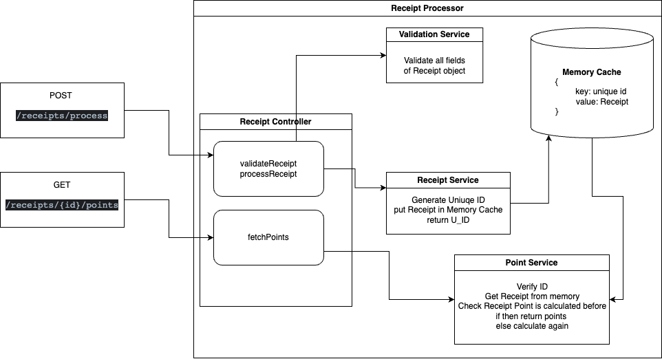

# Read Me First

The following technologies stack used as part of building this project:

* Java 17
* Spring-Boot 3

# Getting Started

### How to run
- you can run application using docker or spring-boot maven both
#### Using Docker
* go to main directory 
```
cd /receipt-processor-challenge
```
* build spring boot image in docker using below command
```
docker build -t receipt-processor-challenge .
```
* run docker file 
```
docker run -p 8080:8080 receipt-processor-challenge
```
#### Using maven
- for this you need Java 17 installed on your machine to install java 17 follow given official docs
  https://www.oracle.com/java/technologies/javase/jdk17-archive-downloads.html
* go to main directory
```
cd /receipt-processor-challenge
```
* run below mvnw command
```
./mvnw spring-boot:run
```

### Guides

#### Process Receipt
```curl
POST http://localhost:8080/receipts/process
```
body:
```json
{
  "retailer": "M&M Corner Market",
  "purchaseDate": "2022-03-20",
  "purchaseTime": "14:33",
  "items": [
    {
      "shortDescription": "Gatorade",
      "price": "2.25"
    },{
      "shortDescription": "Gatorade",
      "price": "2.25"
    },{
      "shortDescription": "Gatorade",
      "price": "2.25"
    },{
      "shortDescription": "Gatorade",
      "price": "2.25"
    }
  ],
  "total": "9.00"
}
```
Note: here in json object all fields are required otherwise it will send error message
- here handled validation as well

Console:
```json
{
    "id": "b7bd85bc-e1e2-4a03-b61a-d6d072a36c00"
}
```

#### Get Points
```curl
GET http://localhost:8080/receipts/b7bd85bc-e1e2-4a03-b61a-d6d072a36c00/points
```
Console:
```json
{
    "points": 109
}
```

- here I have handled wrong id scenario as well


NOTE: URL is HTTP not HTTPS, otherwise it is fallback to SSL


### Service Architecture


